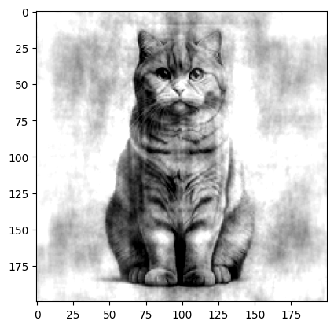
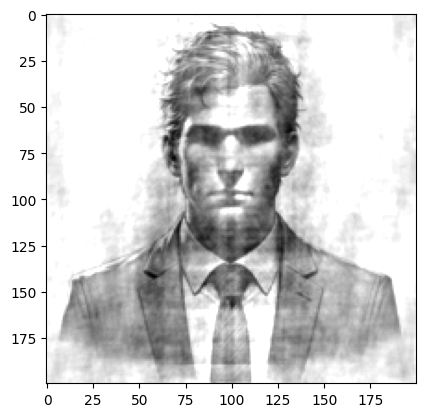

# Fourier_Phase_Analysis_and_Reconstruction
This code is using Fourier Transform techniques to analyze and reconstruct images by using their phase and magnitude components. 
The question and solution shows the importance of the phase component in image reconstruction.

### Question
- Consider two images a and b:
    - Compute their Fourier transform and extract the magnitude and phase.
    - Visualize and compare the results for both images.
- Swap the phase components of the Fourier transforms of the two images while preserving the magnitude.
    - Reconstruct and display the new images.

This code uses two images:

<table align="center">
  <tr>
    <td align="center">
       
    </td>
    <td align="center">
       
    </td>
  </tr>
</table>

### Results of Reconstructed Images:
In the first reconstructed image, the phase of the cat image is combined with the magnitude of the man's image.
The reconstructed image visually resembles the cat, even though the magnitude information originates from the man's image.
This highlights the critical importance of the phase in retaining the recognizable structural details of the image.
<table align="center">
  <tr>
    <td align="center">
       
    </td>
  </tr>
</table>

In the next reconstructed image, the phase of the man image is combined with the magnitude of the cat's image.
The next reconstructed image visually resembles the man, even though the magnitude information originates from the cat's image.
<table align="center">
  <tr>
    <td align="center">
       
    </td>
  </tr>
</table>

